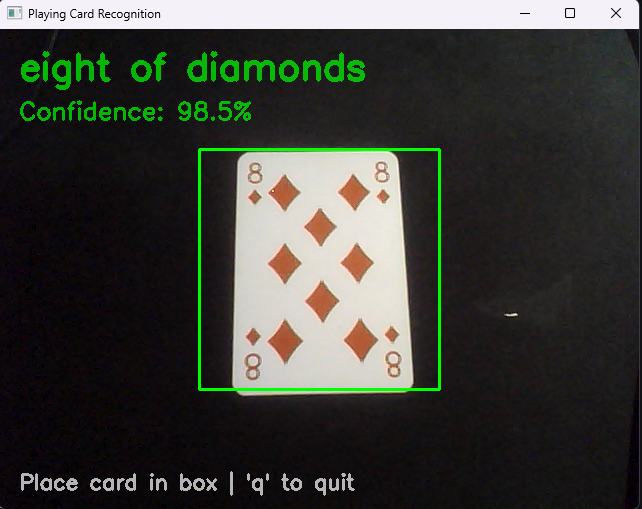
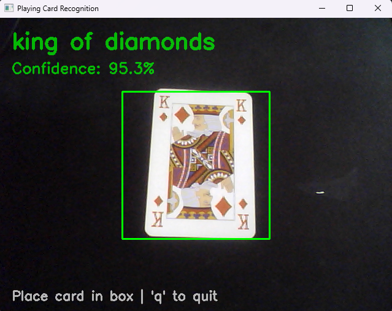
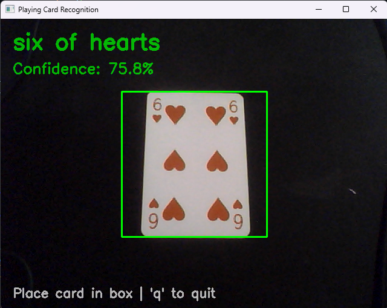
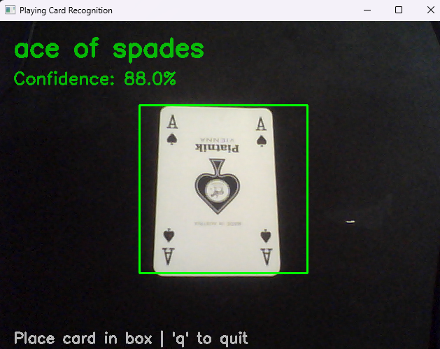
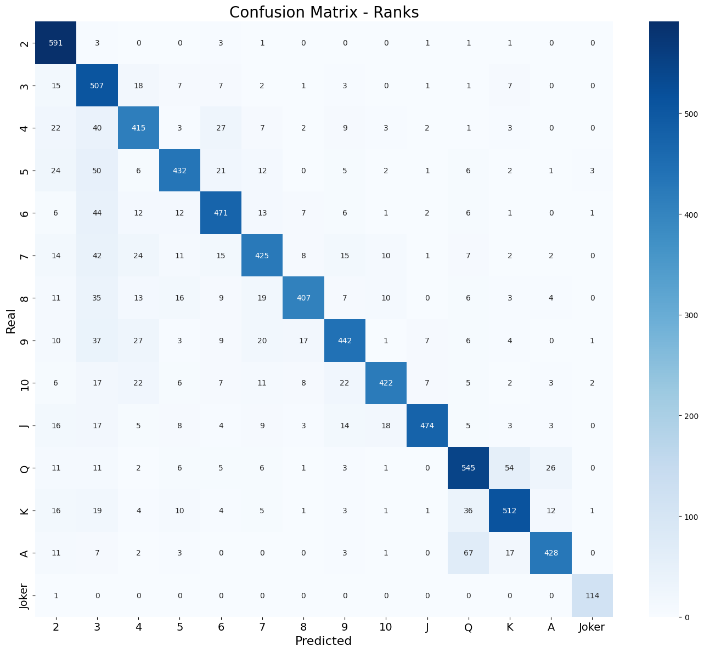
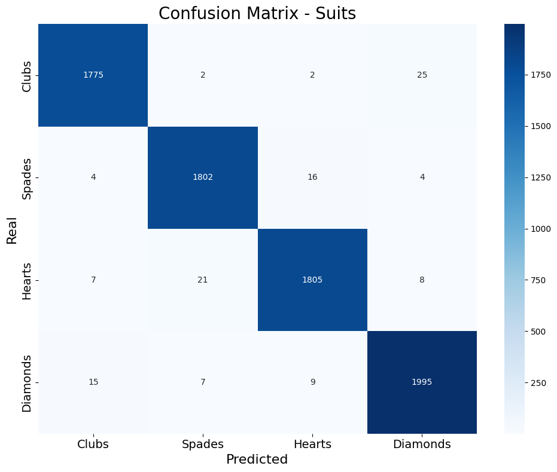

# 🃏 Playing Card Recognition

A deep learning project for playing card recognition using Convolutional Neural Networks (CNNs) in PyTorch. Includes scripts for training, evaluation, testing, and real-time camera-based recognition.

---

## 📁 Project Structure

```
├── cameraRecognition.py       # Real-time card recognition via webcam
├── modelTesting.ipynb         # Model evaluation and visualization notebook
├── NeuralNetworkMain.py       # Neural network architecture, training, and utilities
├── transform.py               # Data augmentation and transformation helpers
├── acc81.5/                   # Trained models, results, plots, and confusion matrices
├── dataset/                   # Dataset (train/valid/test splits)
├── README.md                  # Project documentation
└── __pycache__/               # Python cache
```

---

## 🛠️ Requirements

- Python ≥ 3.10  
- PyTorch  
- torchvision  
- scikit-learn  
- matplotlib  
- seaborn  
- OpenCV  

Install all dependencies with:

```
pip install torch torchvision scikit-learn matplotlib seaborn opencv-python
```

---

## 🗂️ Dataset Structure

Place your dataset inside the `dataset/` directory, structured as follows:

```
dataset/
├── train/
├── valid/
└── test/
```

Each subfolder should contain one folder per card class, e.g., `AH/`, `10C/`, `QS/`, etc., with images inside.

---

## 🧠 Model Training

Train your neural network using the functions in `NeuralNetworkMain.py`.

---

## 📊 Model Evaluation

Use the `modelTesting.ipynb` notebook to:

- Load the best model (`acc81.5/best_model.pth`)
- Evaluate accuracy on the test set
- Generate and visualize confusion matrices for:
  - Color
  - Rank
  - Suit
  - Full classes (e.g., "AH", "10S")

---

## 🎥 Real-Time Recognition

Run the following command:

```
python cameraRecognition.py
```

The script will activate your webcam and start recognizing visible cards in real time.

---

## 🖼️ Results (Examples)

### 🔍 Live Recognition Sample:
<p align="center">
  
  
</p>
<p align="center">
  
  
</p>


### 📈 Training / Validation Curve:
<p align="center">
  
</p>


### ♠️♥️♦️♣️ Confusion Matrices – Rank / Suit:




---

## 📦 Contents of `acc81.5/`

- `best_model.pth` — best performing trained model
- Training/validation loss and accuracy plots
- Confusion matrices for various categories

---

## 📄 License

This project is intended for educational and research purposes only.
